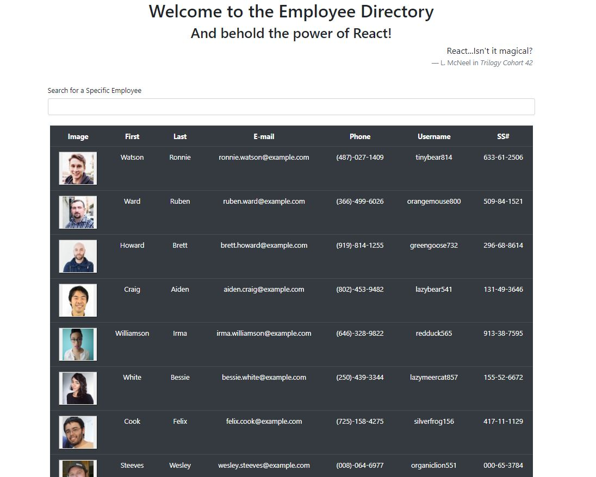
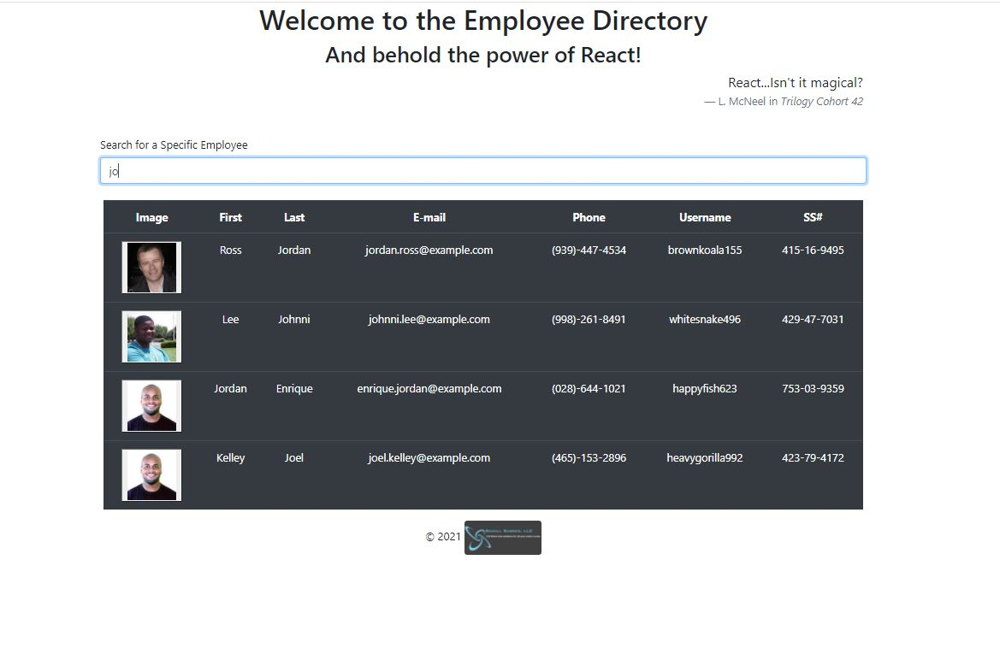
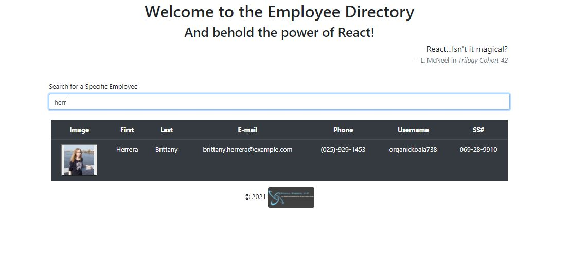

# Employee Tracker - React!

## Deployed site

-   https://practical-bhabha-57a124.netlify.app/
-   https://github.com/mrllanes/Employee-Directory-React

## Table of Contents

-   [Description](#description)
-   [Installation](#installation)
-   [Usage](#usage)
-   [Technology](#technology)
-   [Contributions](#contributions)
-   [Questions](#questions)

## Description

Employee trackers and directories are easy ways to find/lookup information on your staff members. Here is a simple, yet powerful Employee Tracker for you to easily lookup information on any of your staff.

## Installation Instructions

The Employee Tracker - React! is live at the above mentioned netlify link. You can go now to the website and see how the app works with the API populated information. Alternatively, you can branch to this repo, download the files, execute "npm install" to install all the dependencies. After the npm installs are done, execute "npm start." Since this is a React program, it will automatically launch your default browser with a new tab showing "localhost:3000." At this point you can choose to replace the Randomuser API information with your own, and there you have it!

## Usage

The employee information included in this code is API generated. Replace this API information with your employee database (i.e. Mongo Database or MySQL Database). Launch your web interface and all of your employee's information will auto-populate. In the Search bar, start typing in the first name, last name, or email of the specific person you want to find. As you type the name, the employee table will filter the employees to what you are typing in, dynamically and on the fly.

## Technology Stack

The following technologies were used to create this site/application/software/project:
HTML, CSS, Bootstrap, Node, React, Random User API, and more.

## Contributions

The following individuals contributed to the creation of this site/application/software/project:
The following individuals contributed to the creation of this site/application/software/project:
Super Awesome support team and Incredibly Awesome Instructor/Facilitator. Also very nice and enthusiastic Cohort members.

## Questions

If you have questions or comments about this project, please feel free to contact me via e-mail:
llanesm@gmail.com

You can also find more of my projects on my GitHub page:
https://github.com/mrllanes

## Screenshots

Please see the images below to see how the Employee Tracker - React! App looks!

